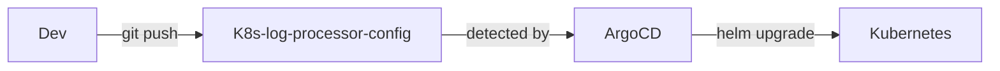

# K8s-log-processor-config

GitOps config repo for [K8s-log-processor](https://github.com/4b93f-organization/K8s-log-processor). ArgoCD watches this repo — push a change, the cluster updates automatically.

## How it works



## Structure

```
K8s-log-processor-config/
├── argocd/
│   ├── application.yaml        # ArgoCD app — deploys the Helm chart
│   └── monitor.yaml            # ArgoCD app — deploys kube-prometheus-stack
├── chart/
│   ├── Chart.yaml
│   ├── values.yaml             # all config lives here
│   └── templates/
│       ├── api.yaml
│       ├── api-service.yaml
│       ├── worker-deployment.yaml
│       ├── worker-service.yaml
│       ├── worker-servicemonitor.yaml
│       └── namespace.yaml
└── grafana/
    └── worker-dashboard.json   # Grafana dashboard for worker metrics
```

## Configuration

All values are in `chart/values.yaml` — images, replicas, resources, env vars. No hardcoding in templates.

To change the API image:
```yaml
api:
  image: ghcr.io/<org>/K8s-log-processor-api:<tag>
```

## Monitoring

`monitor.yaml` installs `kube-prometheus-stack` (Prometheus + Grafana + Alertmanager).

`worker-servicemonitor.yaml` auto-discovers worker pods exposing metrics on port 8000 with label `scrape: "true"`.

Dashboard panels:
- Messages processed/failed rate
- OCR success/failure totals
- HTTP errors found in logs
- Processing duration histogram

## CI

GitHub Actions runs `helm lint` + `helm template` on every push to validate the chart renders correctly.
